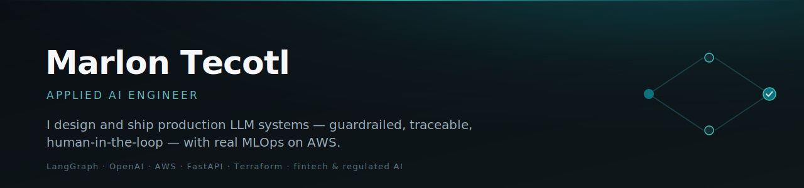

I build **LLM systems that reach production** — not demos. The parts that matter in a
regulated context: output validation, guardrails, human-in-the-loop, traceability, and
the MLOps to run it (eval-gated CI, IaC, observability). Mostly **Python · FastAPI ·
LangGraph · OpenAI · AWS**.

---

### ⭐ Featured — [`payops-copilot`](https://github.com/marlontecotl/payops-copilot)

AI automation for the **fintech SDLC and payment operations** — a LangGraph engine that turns
a requirement into a reviewed, test-gated microservice, and a payments-ops agent with
confidence-gated **human approval for any money movement**. Deployed on **AWS** (Terraform →
live DynamoDB/S3/KMS, GitHub-OIDC CI/CD), guardrailed, traceable, PCI/GDPR-aware.

`LangGraph` · `OpenAI` · `AWS` · `Terraform` · `eval-gated CI` · `PCI-DSS & GDPR aware`

---

### What I build

- **Agentic LLM systems** — multi-agent orchestration, function-calling, RAG, streaming, at production scale.
- **Reliability &amp; safety** — structured-output validation, guardrails, confidence-gated **human-in-the-loop**, tamper-evident audit trails.
- **MLOps** — versioned prompt/eval registries, **$0 offline eval-regression gates**, cost/latency metering, OpenTelemetry tracing.
- **DevOps on AWS** — Terraform IaC, ECS/Lambda, DynamoDB/S3/KMS/Secrets, Step Functions, GitHub-OIDC CI/CD — *no static keys*.
- **Domains** — fintech &amp; payments, industrial automation, enterprise conversational AI. Comfortable in regulated, transactional settings.

### Selected work

**Open-source, full runnable code:**

- ⭐ [**payops-copilot**](https://github.com/marlontecotl/payops-copilot) — AI-SDLC + payments-ops platform, **deployed on AWS** (Terraform → live DynamoDB/S3/KMS, OIDC CI/CD).
- [**AI sales agent**](https://github.com/marlontecotl/ai-sales-agent) — multi-tenant WhatsApp sales agent · **full code + 46 tests, green CI** · STRIDE threat model, AI-assisted SDLC.

**Case studies** — architecture + results; source private/owned:

- [**Telecom multi-agent conversational AI**](https://github.com/marlontecotl/telecom-conversational-ai-platform) — 11 agents · ~150 tools · Kubernetes · streaming chat & voice.
- [**Industrial quoting AI**](https://github.com/marlontecotl/industrial-quoting-ai) — GPT-Vision CAD reading → ML cost prediction → CRM quote-to-close (~110k LOC).
- [**Multi-tenant AI chatbot SaaS**](https://github.com/marlontecotl/multitenant-ai-chatbot-saas) — per-tenant RAG + function-calling, Stripe billing.
- [**LLM reliability & categorization**](https://github.com/marlontecotl/llm-reliability-categorization) — dual-LLM failover + anti-hallucination validators (~99.5% availability).
- [**LLM observability platform**](https://github.com/marlontecotl/llm-observability-platform) — instruments ~220K interactions; automated failure-triage.
- [**NL analytics assistant**](https://github.com/marlontecotl/nl-analytics-assistant) — ask-your-data over KPIs, multi-agent, streamed to React.
- [**PCI-safe AI support agent**](https://github.com/marlontecotl/telecom-ai-support-agent) — tool-using agent with RSA field-level card/CVV encryption.

---

### Currently

🟢 **Open to Lead / Senior AI &amp; MLOps roles.** I like hard, measurable problems where AI has to be
correct, safe, and shipped — not just impressive in a notebook.

📫 **[marlontecotl@gmail.com](mailto:marlontecotl@gmail.com)** · [**LinkedIn**](https://www.linkedin.com/in/marlon-tecotl/) · start with [`payops-copilot`](https://github.com/marlontecotl/payops-copilot) to see how I work.

Fast to prototype, disciplined to production. I fail fast, measure, and ship.
